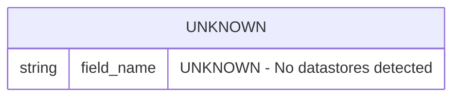

# Data Model Document

**Project:** specs
**Document Version:** 1.0
**Generated At:** 2026-03-11T17:17:20Z
**Source Root:** `/Users/dshills/Development/projects/witness/specs`

---

## Overview

This document describes the data model for the **specs** project, derived from automated fact-model extraction performed on 2026-03-11. The fact model was analyzed for datastores, entity schemas, relationships, and potential PII-bearing fields.

> ⚠️ **Notice:** No datastores, components, APIs, jobs, integrations, or configuration sources were detected during fact-model extraction. All sections below reflect the absence of discoverable data artifacts. Fields that cannot be derived from the fact model are marked as **UNKNOWN**.

---

## Detected Datastores

| # | Datastore Name | Type | Host | Port | Database | Schema Confidence |
|---|---------------|------|------|------|----------|-------------------|
| — | UNKNOWN | UNKNOWN | UNKNOWN | UNKNOWN | UNKNOWN | 0% |

> No datastores were detected in the fact model (`"datastores": []`). The table above represents the empty state of the extraction result.

---

## Inferred Entity Schemas

Because no datastores were identified, no entity schemas could be inferred. The subsections below document the expected schema structure that **would** be populated upon successful detection.

### Entity Template (No Entities Detected)

| Field Name | Data Type | Nullable | Primary Key | Foreign Key | PII | Notes |
|------------|-----------|----------|-------------|-------------|-----|-------|
| UNKNOWN | UNKNOWN | UNKNOWN | UNKNOWN | UNKNOWN | UNKNOWN | No entities detected |

---

## PII-Flagged Fields

No fields were analyzed for PII because no datastores or schemas were detected.

> ⚠️ **PII Scan Result:** The security block reports `"confidence_score": 0` and `"inferred": false`, with `"source_files": null` and `"line_ranges": null`. This indicates that **no PII analysis was performed or completed** during this extraction run. A manual review or re-extraction with source files present is strongly recommended before this project handles any personal data.

---

## Entity Relationship Diagram

The following Mermaid ER diagram reflects the current (empty) state of the detected data model. No entities or relationships could be charted.

> **Note:** This diagram will be populated automatically once datastores and entities are successfully detected in a subsequent fact-model extraction run.

---

## Security & Compliance Summary

| Property | Value |
|----------|-------|
| Source Files Scanned | `null` (none detected) |
| Line Ranges Analyzed | `null` (none detected) |
| Security Confidence Score | `0` |
| PII Inferred | `false` |
| Manual Review Required | **Yes** |

---

## Extraction Metadata

| Property | Value |
|----------|-------|
| Schema Version | `1.0` |
| Generated At | `2026-03-11T17:17:20.078443Z` |
| Project Name | `specs` |
| Root Path | `/Users/dshills/Development/projects/witness/specs` |
| Languages Detected | None (`[]`) |
| Components Detected | None (`[]`) |
| APIs Detected | None (`[]`) |
| Datastores Detected | None (`[]`) |
| Jobs Detected | None (`[]`) |
| Integrations Detected | None (`[]`) |
| Config Sources Detected | None (`[]`) |

---

## Recommendations

1. **Re-run extraction with source files present.** The `root_path` exists but no languages or components were detected, suggesting the extractor may not have had access to source code at scan time.
2. **Verify language support.** The `"languages": []` field indicates no programming languages were identified. Confirm that the project directory contains supported source files.
3. **Perform a manual PII audit.** Given a security confidence score of `0`, any fields containing personal data (names, emails, addresses, identifiers, etc.) must be reviewed and documented manually until automated detection is operational.
4. **Populate integration and job definitions.** No jobs or integrations were found. If the project relies on scheduled tasks or third-party services, these should be declared explicitly so data-flow analysis can be completed.

---

*This document was generated automatically from a fact model snapshot. All **UNKNOWN** values should be resolved by re-running extraction against a complete source tree or by supplying schema definitions manually.*