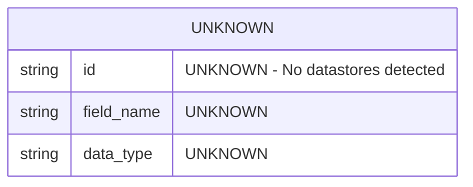

# Data Model Document

**Project:** specs
**Document Generated:** 2026-03-11
**Schema Version:** 1.0
**Root Path:** `/Users/dshills/Development/projects/witness/specs`

---

## Overview

This document describes the data model for the **specs** project as inferred from the fact model snapshot generated on `2026-03-11T17:02:36.814329Z`. The fact model was analyzed for datastores, entity schemas, relationships, and security-sensitive fields.

> ⚠️ **Notice:** No datastores, components, APIs, jobs, integrations, or configuration entries were detected in this fact model. All sections below reflect the absence of discoverable data artifacts. Fields and structures that cannot be derived from the fact model are marked as **UNKNOWN**.

---

## Detected Datastores

| # | Datastore Name | Type | Host | Port | Schema/Database |
|---|---------------|------|------|------|-----------------|
| — | UNKNOWN | UNKNOWN | UNKNOWN | UNKNOWN | UNKNOWN |

> No datastores were detected in the fact model (`"datastores": []`). The table above cannot be populated from the available data.

---

## Entity / Schema Definitions

No entities or schemas could be inferred from the fact model. The `components`, `apis`, and `datastores` arrays are all empty, providing no source from which field names, types, or relationships can be derived.

| Entity Name | Field Name | Data Type | Nullable | PII | Notes |
|-------------|-----------|-----------|----------|-----|-------|
| UNKNOWN | UNKNOWN | UNKNOWN | UNKNOWN | UNKNOWN | No entities detected |

---

## PII-Flagged Fields

No PII analysis was performed or detected. The security block reports:

```json
{
  "confidence_score": 0,
  "inferred": false,
  "source_files": null,
  "line_ranges": null
}
```

> ⚠️ **PII Warning:** A confidence score of `0` and `inferred: false` indicate that no security or PII scanning was completed. **This does not confirm the absence of PII.** A manual review or re-scan is strongly recommended before this project handles any personal data.

| Field | Entity | PII Category | Confidence | Status |
|-------|--------|-------------|------------|--------|
| UNKNOWN | UNKNOWN | UNKNOWN | 0% | ⚠️ Scan not completed |

---

## Relationships

No inter-entity relationships can be derived because no entities, datastores, or components were detected.

| Relationship | From Entity | To Entity | Cardinality | Foreign Key |
|-------------|-------------|-----------|-------------|-------------|
| UNKNOWN | UNKNOWN | UNKNOWN | UNKNOWN | UNKNOWN |

---

## ER Diagram

The following diagram reflects the current state of the fact model. Because no entities or datastores were detected, no relationships or tables can be rendered.



> **Note:** This diagram will be populated automatically once datastores and components are detected in a subsequent fact model scan.

---

## Security Summary

| Property | Value |
|----------|-------|
| Source Files Scanned | `null` — None identified |
| Line Ranges Analyzed | `null` — None identified |
| Confidence Score | `0` |
| Inferred | `false` |
| PII Fields Detected | None (scan not completed) |

> ⚠️ **Security Risk:** The security confidence score is `0` and no source files were scanned. The data model cannot be certified as free of sensitive or PII data. A full security and PII scan must be conducted before production use.

---

## Metadata

| Property | Value |
|----------|-------|
| Project Name | specs |
| Root Path | `/Users/dshills/Development/projects/witness/specs` |
| Languages Detected | None (`[]`) |
| Components Detected | None (`[]`) |
| APIs Detected | None (`[]`) |
| Datastores Detected | None (`[]`) |
| Jobs Detected | None (`[]`) |
| Integrations Detected | None (`[]`) |
| Config Entries Detected | None (`[]`) |
| Schema Version | 1.0 |
| Fact Model Generated At | 2026-03-11T17:02:36.814329Z |

---

## Recommendations

1. **Re-run the fact model scanner** against the project source code to ensure all datastores, components, and APIs are correctly discovered.
2. **Verify the root path** (`/Users/dshills/Development/projects/witness/specs`) is accessible and contains analyzable source files.
3. **Enable language detection** — the `languages` array is empty, which may indicate the scanner did not recognize the project's language stack.
4. **Perform a PII and security scan** with a confidence threshold above `0` before any data handling decisions are made.
5. **Update this document** once a populated fact model is available.

---

*This document was auto-generated from a fact model snapshot. All **UNKNOWN** values indicate fields that could not be derived from the provided data.*