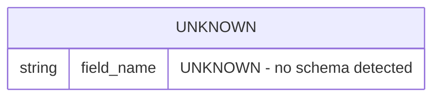

# Data Model Document

**Project:** specs
**Generated At:** 2026-03-11T16:45:37Z
**Schema Version:** 1.0
**Root Path:** `/Users/dshills/Development/projects/witness/specs`

---

## Overview

This document describes the inferred data model for the **specs** project. It was generated automatically from a static analysis fact model. No datastores, components, APIs, or integrations were detected during analysis. All sections below reflect the state of the fact model at generation time.

> ⚠️ **Notice:** The fact model contains no detected datastores, schemas, entities, or fields. All data model details are **UNKNOWN** and cannot be derived from the available facts. This document serves as a structural placeholder pending further analysis or manual annotation.

---

## Detected Datastores

| # | Name | Type | Host | Port | Database | Auth |
|---|------|------|------|------|----------|------|
| — | UNKNOWN | UNKNOWN | UNKNOWN | UNKNOWN | UNKNOWN | UNKNOWN |

> No datastores were detected in the fact model (`datastores: []`). The table above cannot be populated.

---

## Inferred Schemas

No schemas could be inferred. The following subsections are structural placeholders.

### Entity: UNKNOWN

| Field Name | Data Type | Nullable | Default | PII | Notes |
|------------|-----------|----------|---------|-----|-------|
| UNKNOWN | UNKNOWN | UNKNOWN | UNKNOWN | UNKNOWN | No entities detected |

---

## PII-Flagged Fields

No fields were analyzed for PII. The security block in the fact model reports:

| Property | Value |
|----------|-------|
| `confidence_score` | `0` |
| `inferred` | `false` |
| `source_files` | `null` |
| `line_ranges` | `null` |

> ⚠️ **PII Status:** PII detection did not run or produced no results. No fields can be confirmed safe or flagged. A manual PII review is strongly recommended before this project handles any personal data.

---

## Entity Relationship Diagram

No entities or relationships were detected. The diagram below reflects an empty model.

> **Note:** This diagram is a placeholder. No real entities, attributes, or relationships could be derived from the fact model. Replace `UNKNOWN` entries once datastores and schemas are identified.

---

## Component & Integration Summary

| Category | Count | Notes |
|----------|-------|-------|
| Components | 0 | `components: []` — none detected |
| APIs | 0 | `apis: []` — none detected |
| Datastores | 0 | `datastores: []` — none detected |
| Jobs | 0 | `jobs: []` — none detected |
| Integrations | 0 | `integrations: []` — none detected |
| Config Entries | 0 | `config: []` — none detected |
| Languages Detected | 0 | `languages: []` — none detected |

---

## Analysis Gaps & Recommendations

The following gaps were identified based on the empty fact model:

1. **No source languages detected** — Ensure the analysis tool supports the languages used in this project and that source files are present at the declared root path.
2. **No datastores found** — If this project uses a database, cache, or file-based store, verify that connection strings, ORM models, or schema files are present and parseable.
3. **No components or APIs found** — Service boundaries and API contracts cannot be documented without detected components.
4. **PII detection did not run** — Re-run analysis with PII scanning enabled and confirm `confidence_score > 0` before handling personal data.
5. **Security block is empty** — A security review should be scheduled independently of automated tooling given the lack of automated findings.

---

## Document Metadata

| Property | Value |
|----------|-------|
| Document Status | Placeholder — no data detected |
| Fact Model Schema Version | 1.0 |
| Analysis Timestamp | 2026-03-11T16:45:37.182285Z |
| Author | Auto-generated by technical documentation pipeline |
| Next Review | UNKNOWN — schedule after re-analysis with populated source files |